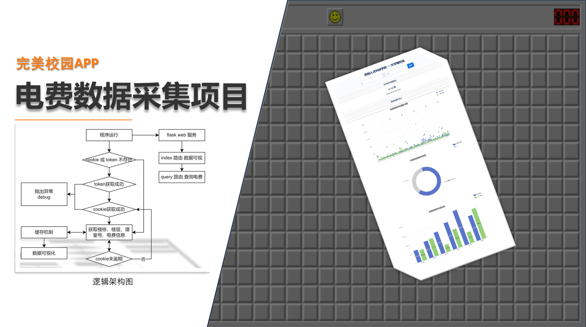

# 完美校园电费爬虫
> 免责声明:项目只供学习交流使用
> 

### 功能
- 实时电费查询
- 电费爬虫+可视化

### 使用 - 非开箱即用
0. tool文件夹注册设备ID
1. 去api.py更新某些固定参数
2. 前往main.py配置账号密码设备号
3. Cookie查询失败才会更新，可以自己设置一个URL监控
4. 之后就不要再使用APP登录了

### 特别感谢
- 完美校园模拟登录 https://github.com/JarvisLeung/wanmei_campus
